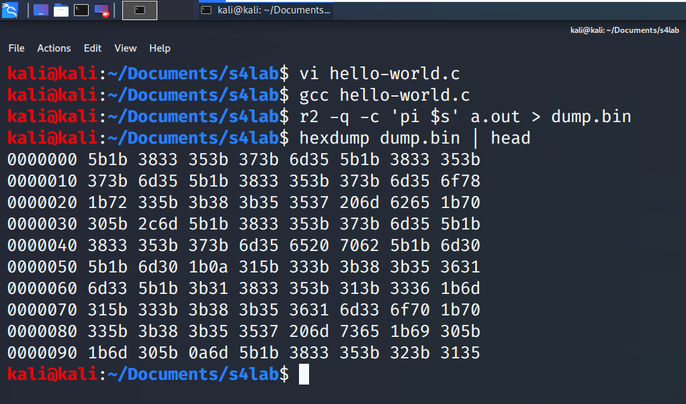

# Answer of Questions  
### 1. Many websites expose their “.git” files, please show how it could be dangerous.  
Exposing git file in fact is equal to make your repo public.  
If there is confidential info hardcoded in the source code of websites (e.g. database configs, encryption keys, etc.) it could be very dangerous.  
But if the website doesn't hardcode sensitive information, then it's fine. But keep in mind, by revealing source code of a website, an attacker can achieve more valuable information of website design and it could be so helpful for him/her to perform mallicious action. Although in secure software development it is recommended not to follow **Security by Obscurity**.  
### 2. Imagine that we have 2^48 text files. Explain how can we find which files are the same.  
Comparing two set of files is possible via `diff` command. It can be used with `-r` switch in order to compare the content of two folders.  
If the content of aforementioned text files are not small in size, generating cryptographic digests (by using **hash functions**) of files can be useful. Thus we can compare digests instead of comapring the whole files.  
### 3. Write a hello-world C program and explain how we can dump its binary code with radare2.  
Steps and commands entered to do so is shown in the following figure.  
  
`r2` is for radare2. `-q` switch exits the radare2 shell after executing the command specified by `-c` switch. `pi` commands prints a number of bytes of the binary file. As the `%s` indicates the file size, so `pi %s` command dumps the whole binary file.  
